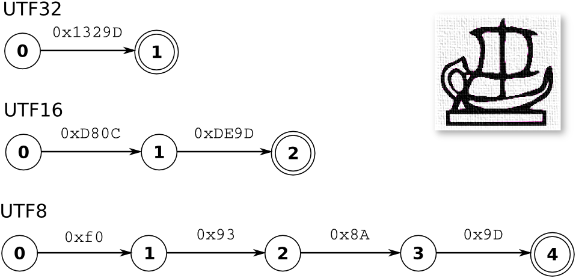

Sequential Data Streams
=======================

This section delivers precise definitions to be used in this text for the terms
grapheme, glyph, character, letter, code point, code unit, and buffer element
type. The reason for that is to provide a solid basis of discussion, since
those terms often have slightly different meanings in different fields of
science.

Grapheme:
    A minimally distinctive unit of writing in the context of a particular 
    writing system :cite:`Unicode2015`. The arabic letter ل  (lam) and 
    the vocalization mark |damma| |nbsp| (damma) are graphemes. The 
    vocalized ُل is not.

.. |damma|  unicode:: U+064F .. ARABIC DAMMA
.. |nbsp|   unicode:: U+00A0 .. NO-BREAK SPACE

Glyph:
    An graphical representation of a grapheme. This may include a specification
    of font, slant, and style.

Code Point:
    A numeric value representing a grapheme. Unicode :cite:`Unicode2015` 
    defines distinct mappings from graphemes to code points for many 
    writing systems.

The concepts of a character and a letter are very close. In this text
each one represents the union of both meanings, namely:

Character/Letter:
   A symbol, such as a letter or number, that represents information (Definition 
   4.b of 'character', Webster Online Dictionary). 

   A symbol usually written or printed representing a speech sound and 
   constituting a unit of an alphabet (Definition of 'letter', Webster
   Online Dictionary).  In particular, the letters A, C, G, and T 
   may represent the alphabet of nucleotide basis of a DNA strand.

   Notably, a 'human-perceived' character may be represented by more than 
   one graphemes, and therefore by more than one code point.

Text can be stored in a variety of encodings. An encoding must provide a
mapping from a code point to a sequence of code units.

Code Unit:
    A code unit is a bit sequence used to encode code points according
    to a given encoding [#f4]_. 

A lexer identifies something which is recognized as some type of *word*, that
is a sequence of adjacent characters that carry a meaning. For a lexer that
runs on Unicode, the lexatoms consist of the code points required to describe
the character sequence. The same is true, if the lexer is fed with input that
has been converted to Unicode. If the lexer runs directly on an encoding, 
then the lexatoms are the instance of the related code units that constitute
the code points. Dependent on what a lexatom is, a lexeme is either given 
as sequence of code points or a sequence of code units.

A Quex generated lexer runs on buffered content. A buffer is an array of memory
where each element is large enough to carry a lexatom. The buffer element type
is a computer language specific expression. It defines the size and
interpretation of an array element in memory. If the buffer element type is
chosen as ``uint16_t`` from C99, then a buffer is a list of unsigned 2-byte
wide numbers. Then, a lexatom can at maximum have the value 65535. This text
also use the term 'lexatom size' indicating how many bytes a lexatom requires
to occupy.

At a time, when there was only ASCII :cite:`Standard2018cs50` encoded text, the
letter 'A', i.e.  the code point 65, was repesented by a single code unit,
namely 65, and it was stored in a single byte. A graphics chip might have
directly displayed a pixelized glyph of 'A' when 65 was stored in a byte of its
memory region.  In this context, phrases such as '*a lexical analyzer iterates
over bytes*' or '*the state machine triggers on the letter A*', made sense,
indeed.  However, in a general context of arbitrary writing systems and
encodings, such statements become cloudy. 

.. _fig:lexatom-explanation:

   
   Egyptian Hieroglyph P002 and lexers running on different encodings UTF32, 
   UTF16, and UTF8.

:numref:`fig:lexatom-explanation` shows the example of the Egyptian Hieroglyph
P002. The character consists of a single code unit, i.e. the glyph represents
the according grapheme. Depending on the used encoding three different state
machines are depicted. When a lexer runs on Unicode (UTF32) the hieroglyph is
matched by a single lexatom given as 0x1329D which is identical to the code
point. The cells that carry lexatoms should be at least 3 byte wide.  When the
dynamic length encoding UTF16 is used, the character is represented by two
lexatoms 0xD80C followed by 0xDE9E. The code unit is two byte wide. In UTF8,
the same character is represented by a sequences of lexatoms namely 0xF0,
0x93, 0x8A, and 0x9D. A code unit fits into a single byte. In this case four
instances of a code unit, for lexatoms, represent the given code point.

The concepts of a code unit and a lexatom seems subtle. TODO
which acts as event in a state machine. If a state machine runs on code points,
a lexatom is a code point. Additionally, the term code unit is rather uncommon
outside the field of Unicode and character encoding. To express generality
beyond the treatment of human-readable text, the author of this text chose the
term lexatom in the context of lexical analysis.

.. rubric:: Footnotes

.. [#f4] The definition here deviates from the one given in :cite:`Unicode2015`: 
   *"The minimal bit combination that can represent a unit of encoded text 
   for processing or interchange. The Unicode Standard uses 8-bit code units in 
   the UTF-8 encoding form, 16-bit code units in the UTF-16 encoding form, and 
   32-bit code units in the UTF-32 encoding form."*

