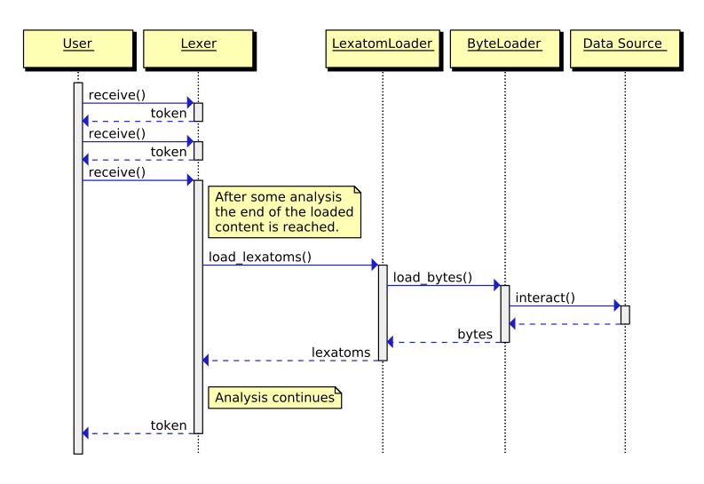
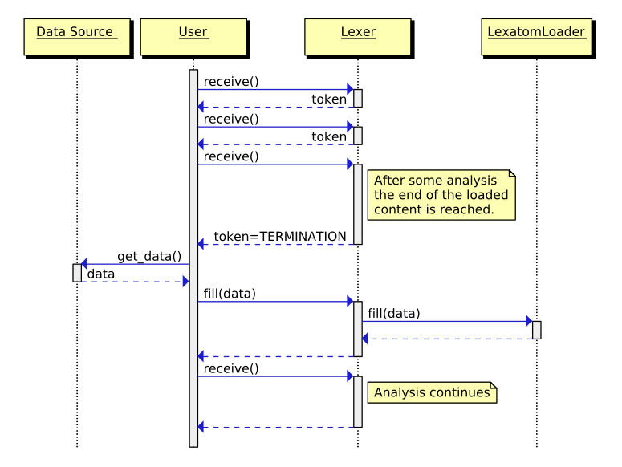

Input
=====

A Quex generated lexer can either acquire the data for its buffer
*automatically* or via a *manual filling* action by the user. Programming
interfaces [#f1]_ for loading or receiving bytes may differ. Further, there
might be some conversion [#f2]_ needed before the incoming data is in a form
where it can be lexically analyzed. To cope with this, input is provided
in two stages represented by the classes ``ByteLoader`` and ``LexatomLoader``.

:rumref:`fig:input-procedure-stages` shows this setup.  The
``ByteLoader`` interface allows to mount a variety of different adapters that
connect to APIs for data acquisition. The ``LexatomLoader`` interface relies on
the ``ByteLoader`` interface to load data. It provides on the other hand an
interface for the buffer to load lexatoms. Depending on the particular
scenario, an appropriate derivative of ``ByteLoader`` and ``LexatomLoader``
may be setup. User customized derivatives for both may be plugged in at need.

.. _fig:input-procedure-stages:

.. figure:: ../figures/byte-lexatom-buffer.png
   
   The path of data from the outside world until it arrives in the lexer's
   lexatom buffer.

By default, buffer loading happens in the background, when new data needs to be
filled into the buffer--without any user interaction.  This is shown in
:numref:`fig-seqdiag-automatic-buffer-loading`. When the lexer hits a buffer
boarder, it requests new lexatoms from its instance of the ``LexatomLoader``. The
``LexatomLoader`` requests data through the ``ByteLoader``.  The ``ByteLoader``
applies its particular API to read data from its source. It then returns data
to the caller. The ``LexatomLoader`` takes this data, possibly converts it, and
fills the buffer region that has been indicated to be filled.  The user is, in
this case, completely unaware of loading, conversion, and possibly stream
navigation activities.

.. _fig:seqdiag-automatic-buffer-loading:

   
   Automatic buffer loading in the background.

:numref:`fig:seqdiag-manual-buffer-filling` shows the flow of action of the
alternative method: manual buffer filling [#f3]_. When the lexer reaches the
end of its present data, it stacks a token signalling *out-of-data*.  The user
must now react by filling new data into the buffer, before the next analysis
step.  To facilitate the process of filling, two adaptors are provided namely
``Feeder`` and ``Gavager``.  A ``Feeder`` feeds as much as possible data into
the buffer and maintains the position of unfed data. A ``Gavager`` lets the
user access the buffer directly.  Even more direct buffer access can be
achieved by pointing the lexer to a specified memory region to be used as
buffer.  Functioning applications of these approaches can reviewed in the
subdirectory `11-ManualBufferFilling` of the demonstration examples.

.. _fig:seqdiag-manual-buffer-filling:

   
   Manual buffer filling.

.. rubric:: Footnotes

.. [#f1] Standard C and C++ provide libraries for input output. Input,
         however, may come also through other APIs, such as POSIX, or 
         VFS for Linux kernel modules.

.. [#f2] Lexatom loading may consist of a plain passing through of incoming
         bytes. Alternatively, Quex provides modules that are able to use 
         GNU-IConv, or IBMs ICU™ for character set conversion.

.. [#f3] Possible scenarios for manual buffer filling are environments where 
         blocking function calls for 'read' are not permitted, environments 
         where data is provided in chunks as function arguments, or 
         setups where a significant performance increase can 
         be expected from running a lexer on prepared memory regions.
