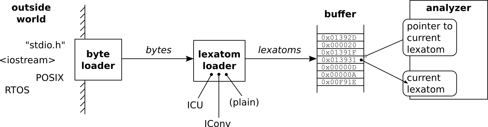

Input
=====

Input data may be provided in a variety of different ways.  First, data may be
delivered through different file handling interfaces, through network or any
other customized protocol. Second, the translation of bytes into lexatoms may
vary dependent on the state machine engine's internal encoding and the prefixed
decoders. To account for this, the load process happens in
two steps as shown in :ref:`fig:byte-lexatom-buffer` implemented by a
``ByteLoader`` and a ``LexatomLoader``:

    #. ByteLoader: Loading raw bytes from some raw byte source. 
           
    #. LexatomLoader: Loading lexatoms derived from raw bytes.

    TODO: Mention the 'ByteLoader_Memory'
    TODO: callbacks 'on_overflow', 'on_content_change'
          that can load sequentially from memory.

The raw byte source may be the Standard C or C++ file handling interface, or
that of POSIX, RTOS, or any other customized interface. A ``ByteLoader``
implements a common API through which any outside data is communicated. The
byte loader produces a byte stream. It  performs stream navigation (tell and
seek) on byte level.  The lexer's buffer, though, requires lexatoms. 

It is the task of the lexatom loader to transform the ``ByteLoader``-s byte
stream into an lexatom stream. The lexatom loader performs stream navigation on
lexatom level. The lexatoms are finally stored in a dedicated chunk of memory:
the buffer. A 'lexatom pointer' points to the current lexatom to be treated.
For the sake of efficiency, the cells of the buffer all need to be of the same
size. Only then, subsequent lexatoms can be accessed quickly by adding a
constant to the lexatom pointer.  

.. _fig:byte-lexatom-buffer:

   
   The path of data from the outside world until it arrives in the lexer's
   lexatom buffer.

Technically, the two entities ``ByteLoader`` and ``LexatomLoader`` are base
classes that specify the interfaces for byte and lexatom loading. Any concrete
implementation is derived from those two. While the default API of a generated
lexer hides their existence, they become important when the input provision
must be customized :ref:`sec:input-provision`.

The two-step input provision is flexible enough to cope with the constraints of
tiny embedded systems, where there is even no Standard C I/O library available,
up to platforms where input streams are decrypted and converted by complex
algorithms.

.. NOTE figures are setup with 'sdedit'. As for version 4.01 a NullPointer
   exception prevents exporting to png. So that has been postponed.
   Consider files: "buffer-automatic-load.sdx" and "buffer-manual-load.sdx"

The buffer filling process may happen in two ways: *automatically* or
*manually*. By default, a generated lexer detects when the end of a buffer is
reached and tries to load new content automatically. In some cases, this not be
practical or efficient (see :ref:`sec-using-mmap-for loading`). For manual
buffer filling, Quex provides adapters, namely 'feeder' and 'gavager'. By means
of those content can be copied into the buffer or even inserted. With these two
adaptors the same infrastructure of byte- and lexatom-loading is used as for
manual filling.  The input procedure may be specified upon a call to the
lexer's constructor, the reset functions, or the include-push functions.

