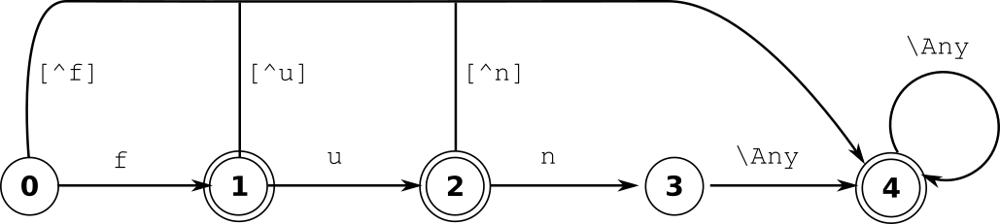

Lexical Analyzers
=================

This section elaborates on the scientific context of lexical analysis. The 
terms 'information' and 'information transfer' are reflected briefly. Then 
two means of information representation, namely 'pcitures' and 'writing' 
are discussed. Writing as it refers to a sequential data stream is what
lexical analysis is about. The remainder of this section presents a common
approach to find patterns in sequential data streams, i.e. state machines.

Information is that what informs :cite:`wiki:Information`. It contains
knowledge, to be observed by a conscious observer, or data. In particular, an
automated system may receive data containing instructions to be implemented.
Information is always conveyed as content of a message.  Information, as we
know it, only exists in the context of information transfer over space and
time.

Information transfer either relies on 'writing' or 'pictures'. Pictures, are
known to convey information very efficiently--quasy in parallel [#f3]_. In
general, the image oriented human mind experiences pictures as something very
tangible.  However, the range of possible statements merely extends the range
of known objects. The efficiency of pictures as means of communication depends
on the intuitive understanding of their graphical elements. Since intuition is
relative this imposes restrictions on the precision of a picture's statement.
Further, a picture tends to loose all of its information, as soon as the
cultural context changes in which it has been developed [#f4]_. While
'pictures' are a powerful means to reflect over configurations of physical
objects :cite:`Szeliski2010computer`, they are not optimal for transport of
information over space and time.

Writing is a form of sequential data transfer. It requires knowledge of the
language being used.  However, the range of describable things extends beyond
the set of known objects. New concepts may be associated with new words relying
on known objects and their relations in a formal and distinct manner.  The
range of possible statements  even exceeds what is imaginable. The distinct and
precise nature of a formal sequential language makes it the prime candidate for
information transfer over space and time. Quex supports this type of
communication by the generation of interpreters of sequential data streams.

Writing, i.e. sequential data streams are traditionally associated with a
stream of letters.  In phonemic writing systems :cite:`CoulmanFlorian1989`,
such as Latin, Arabic, Hebrew, etc., letters correspond to graphemes
representing sounds. The 'letters' of DNA are the four nucleotide bases A
(adenine), C (cytosine), G (guanine), and T (thymine)
:cite:`pevsner2015bioinformatics`.  Letters in digital transmission frames are
bytes or bits. In general terms, lexical analysis detects configurations of
letters and reports accordingly atomic meanings.  How can this be accomplished
by an automated system?

An example *state machine* may be considered in figure
:ref:`fig:state-machine-students-life`.  It displays the slightly idealized
state machine description of a student's daily life. His states are 'study',
'eat', and 'sleep' as they are shown as names framed by ellipses. The
transitions between those states are triggered by finite set of events, namely
him becoming 'hungry', 'replete', 'tired', and an alarm clock that 'buzzes'.
The events are shown as annotations to the arrows indicating state transitions.

.. _fig:state-machine-students-life:

.. figure:: ../figures/state-machine-students-life.png
   
   Description of a student's life in terms of a state machine.

A state machine consists of a set of *states*, *state transition rules*, and
*actions* that are applied upon transitions :cite:`Arbib1972`.  A state in the
state machine can be either *active* or *inactive* indicating its ability to
react to incoming events. A state's transition behavior is specified in terms
of a transition map.

Transition Map
   A transition map belongs to a state. It associates an event with a
   successor state (or states). That is, when the event arrives and the state is
   active, it causes the current state to become *inactive* and the successor
   state (or states) to become *active*. 
   
If a state is active, then its transition map determines what state becomes
active as reaction to the next incoming event.  A special state machine is the
FSM, i.e. the finite state machine :cite:`Roche1997`.  In a
FSM there is only one state active at a time, called the *current state*. This
implies that there is no transition on the 'no event' and the transition maps
associate an event with a distinct successor state. Quex generates FSMs [#f1]_. 
Let the term 'current state' denote the one and only active state of the FSM.

Finite state machines receive events at descrete times, i.e. sequentially.
Thus, the current state is the deterministic result of the *sequence of events*
that has occurred. Here is were the concepts of a state machine and the
interpretation of sequential data meet. The letters of a sequential data stream
satisfy the requirement of sequentiality and that they originate in a closed
set, namely the 'alphabet'.  Thus, letters may play the role of events in the
FSM. A state machine may now be designed in a way so that a paths along the
graph represents a specific letter sequences to be detected. When the state at
the end of that paths becomes active, this indicates that a certain input
pattern has occurred. A simple example of a state machine detecting the word
'fun' can be viewed in :ref:'fig-state-machine-simple.png'.

.. _fig:state-machine-simple:

.. figure:: ../figures/state-machine-simple.png
   
   Paths in state machine for letter sequence detection.

Pattern-matching state machines are called DFA-s, so called *deterministic
finite automatons* :cite:`Hopcroft2006automata`. In a DFA, there is one
category of states which are special: *acceptance states*. The entry action of
an acceptance state is to signalize a match.  

.. _fig:state-machine-for-pattern-matching:

   
   Pattern matching via DFA.

Figure :ref:`fig:state-machine-for-pattern-matching` shows a state machine
where a circle represents a state and the arrows possible state transitions. A
double circle indicates an acceptance state.  The depicted state machine can
detect the word 'fun'. Any aggregation of two or more lowercase letters is
identified as a 'WORD'.  A sequence of characters 'f', 'u', and 'n' guides from
the initial state to state 3. Any non-letter in that state would cause an else
transition, notifying that 'FUN' has been found.  A longer sequence such as
'fund' would be considered a 'WORD' because the transitions continue to state
4.  A sequence of less than two characters drops out either at state 0 or state
    1.  The 'else' path says that in that case a 'FAILURE' would be notified. 

There are two approaches of pattern matching:  *greedy/longest match* and
*shortest match*.  For greedy match, a lexer tries to 'eat' a maximum of
letters until it fails.  It walks along the state machine graph according to
the incoming letters, marks the acceptance of the last acceptance state that
it passed by, and eventually drops-out. Upon drop-out, it recalls the last
acceptance *indicating the longest possible match*. 

Contrary to that, shortest match terminates upon hitting the first acceptance
state. In this way, though, only a subset of all possible pattern
configurations can be matched.  Whenever a pattern matches a superset of
another, the approach fails in favor of the shorter pattern. Thus, when 'for'
and 'forest' were keywords to be detected, the analyzer would always stop at
'for' and never recognize a 'forest'. It follows that the shortest match
approach is not suited for a general solution. The previously mentioned greedy
match approach does. Greedy match is what Quex implements.

.. rubric:: Footnotes

.. [#f1] Indeed, Quex first produces a so called NFA that combines all
         concurrent pattern matches in one single state machine. Then, 
         it applies powerset construction :cite:`Rabin:1959:FAD` to generate 
         a state machine where only one state is active at a time.

.. [#f2] The computer science expression 'lexeme' corresponds to a 'form of
         a lexeme' in linguistics.

.. [#f3] The popularity of the phrase 'A picture is worth a thousand words' 
         :cite:`TessFlanders1911` documents the human's comfort conveying 
         information in pictures.

.. [#f4] The buttons in graphical user interfaces are a good example. At the
         time of this writing, the 'save' button is often symbolized by a 
         storage diskette. The generation of our kids might not be able to
         associate this symbol with any meaning, simply because diskettes
         are no longer in use at all.

.. [#f5] Since the Unicode standard does not assign characters beyond 
         0x10ffff, in real life, the maximum amount of bytes in UTF8 is four.
