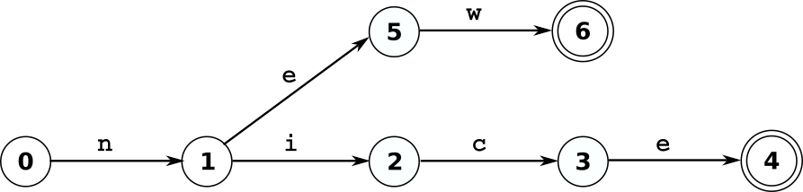

Lexical Analyzers
=================

Information is that what informs :cite:`wiki:Information`. It contains
knowledge, to be observed by a conscious observer, or data to be processed.
The information content, i.e. the entropy :cite:`Shannon1951`, is only
different from zero, if it is present in its source and lacks at its
destination.  Thus, information only exists in the context of information
transfer over space and time. 

Non-ephemeral information transfer either relies on 'pictures' or 'scriptures'.
Pictures convey information very efficiently relying on the recipients
intuition [#f3]_.  This implies that source and drain must share a cultural
context [#f4]_.  In the context of computer vision, pictures are a useful to
describe configurations of objects :cite:`Szeliski2010computer`.  However, the
space of describable things is restricted by the set of objects which are known
to source and drain.

A scriptures :cite:`Fischer2003`, a sequential symbol flow, requires knowledge
of the language being used.  However, the range of describable things extends
beyond the set of known objects. New concepts may be associated with new words
relying on known objects and their relations in a formal and distinct manner.
The range of possible statements  even exceeds what is imaginable. The distinct
and precise nature of a formal sequential language makes it the prime candidate
for information transfer over space and time. Quex supports this type of
communication by the generation of interpreters of sequential data streams.

Sequential data streams are traditionally associated with a stream of letters.
In phonemic writing systems :cite:`CoulmanFlorian1989`, such as Latin, Arabic,
Hebrew, etc. letters correspond to graphemes representing sounds. The
letters of DNA are the four nucleotide bases A (adenine), C (cytosine), G
(guanine), and T (thymine) :cite:`pevsner2015bioinformatics`
:cite:`searls1992linguistics`.  Letters in digital transmission frames are
bytes or bits. In general terms, lexical analysis detects configurations of
letters and reports accordingly atomic meanings.  The subsequent section
shows an approach to interpret sequential data streams. 

State Machines
--------------

This section discusses state machines. An graphical representation of an
example state machine is shown in :numref:`fig:state-machine-students-life`.
It displays the slightly idealized daily life of a student. His states are
'study', 'eat', and 'sleep' as they are shown as names framed by *circles*. The
*arrows* between the states signify transitions between those states which are
triggered by finite set of events. The events are specified as *annotations to
the arrows*, namely: the student feeling *hunger*, *fatigue*, *satiety*, and an
alarm clock that 'buzzes'. The interpretation goes as follows. Assume, the
student is in state *sleep*. When the alarm clock *buzz*-es, he enters state
*study*. He continues until *hunger* emerges or he experiences *fatigue*. The
first event causes him to *eat* the latter causes him to *sleep*, etc.

.. _fig:state-machine-students-life:

.. figure:: ../figures/state-machine-students-life.png
   :scale: 60%
   :align: center
   
   Description of a student's life in terms of a state machine.

A state machine is defined by of a set of *states*, an explicit *initial
state*, a finite set of *events*, *transition rules*, and *actions* that are
applied upon transitions :cite:`Arbib1972`.  A state in the state machine can
be either *active* or *inactive* indicating its ability to react to incoming
events. A state machine exhibits behavior by activation and deactivation of
states as reaction to events specified as 'transition map'. 

Transition Map:
   A transition map of an active state determines what event causes what
   subsequent states to become active in favor of the active state.
   
A special state machine is the the *finite* state machine :cite:`Roche1997`, i.e.
the FSM.  In a FSM there is only one state active at a time called the
*current state*. This implies that there is no transition on the 'no event'
(the so called ε-transition :cite:`Cooper2011`) and transition maps associate an event with a
distinct successor state.  Quex generates FSMs [#f1]_. 

Finite state machines handle events at discrete times, i.e. sequentially.
Consequently, the *current state* is the deterministic result of the initial
state and the event sequence that preceded. As such, the activation of a state
coincides with the detection of a specific pattern in a sequential stream of
letters.  Since the set of possibly occurring letters is a closed set, namely
the *alphabet*,  letters may play the role of events in the FSM.  In the
graphical display of a state machine, letter sequences correspond to pathes
along the states which they activate.  For the sake of precise discussions let
the terms 'lexeme' and 'lexatom' be defined as below.

Lexatom:
   A lexatom is one instance of the finite set of elements in a sequence 
   of data. 

The new term *lexatom* is introduced to distinguish the concept from closely
related terms such as *letter*, *character*, *event*, or *code unit*. It is
discussed in detail in later sections.

Lexeme:
   A lexeme [#f2]_ is a finite sequence of lexatoms.

Pattern-detecting state machines are called DFAs, so called *deterministic
finite automatons* :cite:`Hopcroft2006automata`. They distinguish states that
signal a *pattern match* in the input stream  by labelling them as *acceptance
states*.  The term *pattern* can be given a precise definition. 

Pattern:
   A pattern circumscribes a set of lexemes. It is represented as a 
   configuration of a DFA where only those lexatom sequences reach 
   an acceptance state which belong to the defined set of lexemes.

.. _fig:state-machine-lexer:

   
   Pattern matching deterministic finite automaton.

:numref:`fig:state-machine-lexer` displays a DFA detecting the set of lexemes
(``nice``, ``new``).  A double circle indicates an acceptance state.  If
the lexatoms ``n``, ``e``, ``w`` occur when the state machine is in the initial
state *0*, the state sequence 1, 5, and 6 is passed.  State 6 is an acceptance
state indicating that the pattern matched. Similarily, the lexatoms ``n``,
``i``, ``c``, ``e`` guides through 1, 2, 3, 4, where the last state indicates a
match. However, a deviating sequence such as ``n``, ``i``, ``p`` drops out in
state 2, because there is no transition on ``p``.  The sequence is a mismatch.

There are two approaches of pattern matching:  *longest match* and *shortest
match* :cite:`Frisch2004greedy`. With the shortest match approach, a lexer
stops at the first acceptance state that it reaches. With the *longest match*
approach a lexer only stops upon drop-out, i.e. when there is no further
transition for the given lexatom. 

Shortest match implies restrictions. For example, consider the set of lexemes
(``for``, ``forester``). The lexatom sequence ``f``, ``o``, ``r``, ``e``,
``s``, ``t`` would reach an acceptance state after the third letter. The lexer
would signalize a match of ``for`` and stop.  It could never recognize a
``forest``. This, however, restricts the set of treatable patterns.
Longest match does not impose restrictions. For the sake
of generality, Quex implements the longest match approach.

.. rubric:: Footnotes

.. [#f1] Indeed, Quex first produces a so called NFA that combines all
         concurrent pattern matches in one single state machine. Then, 
         it applies powerset construction :cite:`Rabin:1959:FAD` to generate 
         a state machine where only one state is active at a time.

.. [#f2] The computer science expression 'lexeme' corresponds to a 'form of
         a lexeme' in linguistics.

.. [#f3] The popularity of the phrase 'A picture is worth a thousand words' 
         :cite:`TessFlanders1911` documents the human's comfort conveying 
         information in pictures.

.. [#f4] The buttons in graphical user interfaces are a good example. At the
         time of this writing, the 'save' button is often symbolized by a 
         storage diskette. The generation of our kids might not be able to
         associate this symbol with any meaning, simply because diskettes
         are no longer in use at all.

