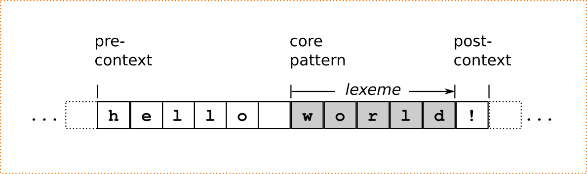

.. _sec:pre-and-post-contexts:

Pre- and Post-Contexts
#######################

To this point, only patterns have been discussed that match absolutely,
independent of their context.  Modes and mode transitions change the complete
matching behavior of a lexer, they change the *language*. A more concise type
of context is the *border* around a pattern, i.e. to what comes before or after
the pattern. This section elaborates on conditional matching based such
bordering contexts namely *pre-* and *post-contexts*. 

Pre- and post-contexts are conditions on the data stream. Strictly, the lexer's
state is not subject to this type of constraint.  There is an exception though:
the conditions 'begin-of-stream' and 'end-of-stream'. Precisely, they are
conditions on the lexer's current input pointer and the byte loader. In the frame
of 'begin-of-line' and 'end-of-line' it would be counter-intuitive not to 
provide those conditions, though. Consequently, conditions on stream boundaries
can be specified as pre- and post-contexts.

.. describe:: <<BOS>> P

    Defines the pre-context 'begin-of-stream'. The pattern ``P`` only matches
    at the beginning of the input stream. 

.. describe:: P <<EOS>>

    Defines the post-context 'end-of-stream'. The pattern ``P`` only matches at
    the end of the input stream. This post context must be considered with care
    in situations where there might be no explicit end-of-stream condition,
    such as byte loaders based on socket connections.

Notably, there must be *white space* between the ``<<BOS>>`` and the pattern as
well as after a pattern which is followed by ``<<EOS>>``.  A pre-context
matches backwards before the start position of the current analyzer step. A
post-context matches after what is matched by the core pattern.  Lexatoms
matching the pre- and post-contexts are not part of the matching pattern's
lexeme.  The example in figure :ref:`pre-and-post-context` shows the example of
a matching pattern::

    "hello "/"world"/"!"

That is, ``world`` is only matched if it appears after ``"hello "`` and before
``"!"``. The lexatoms before and after the sequence ``world`` are considered,
but are they do not contribute to the resulting lexeme which is solely what
matched the regular expression ``"world"``. The first lexatom to be considered
in the next analysis step is the exclamation mark. That is, the input pointer
is set to the position right after where the core pattern matches, even though
further content has been considered already as a post-context.

.. _fig:pre-and-post-context:

   Pre- and post context around a core pattern.
 
The following syntax elements are available for the specification of line
border context rules.

.. describe:: ^R 

   a  regular expression ``R``, but only at the beginning of a line. This
   condition holds whenever the scan starts *right after a newline character*
   or at the *beginning of the character stream* (i.e. ``<<BOS>>`` is implied).
   It scans only for a single newline character 0x0A '\\n' backwards,
   independent on how the particular operating system codes the newline. 

.. describe:: R$ 

    a regular expression R, but only at the *end of a line* or at *the end of
    the input stream* (i.e. <<EOS>> is implied). Traditionally, a newline can
    be coded in two ways: the Unix-way with a plain 0x0A `\n` or the DOS-way
    with the sequence 0x0D 0x0A `\r\n`. By default both are considered as
    post-context.  The command line option ``--no-DOS`` allows one to waive the
    consideration of DOS newlines.

.. note:: 

    Quex tolerates the shorthand `$` at the end of an explicit post
    context. It is then translated into a newline. Thus, the pattern `core/pc$` is
    equivalent to `core/pc(\n|\r\n)`. In that case, however, *end of input stream*
    is not implied.

General border conditions can be defined in terms of regular expressions.  In
the following, Let ``R`` represent the regular expression of the core pattern.
The matching lexeme does only consist of those elements of the input stream
that match ``R``. Let ``Q`` represent pre-context and ``S`` the post-context.
The following list shows the syntactic means to specify pre- and post-contexts.

.. describe:: R/S

   matches an ``R``, but only if it is followed by an ``S``. Upon match the
   input is set right after where ``R`` matched.  ``S`` is the post-context of
   ``R``.  
   
   There is a special circumstance where post-contexts are problematic: the
   'dangerous trailing context' :cite:`Paxson1995flex` problem [#f1]_.  The DFA
   Cut/Concatenate arithmetic introduced in
   :ref:`sec-cut-contatenate-arithmetic` enables a precise definition of this
   problem and a rational solution: the 'philosophical cut'.
		 
.. describe:: Q/R/ 

    matches ``R`` from the current position, but only if it is preceded by a
    ``Q``. Practically, this means the analyzer goes backwards in order to
    determine the condition.  ``Q`` is the pre-context of ``R``.
                  
.. describe:: Q/R/S 

    matches ``R`` from the current position, but only if the preceding matches
    a ``Q`` and the following matches an ``S``.  ``Q`` is the pre-context of
    ``R`` and ``S`` is its post-context.

Neither pre- nor post-context must match a lexeme of length zero. The condition
to match lexeme of length zero is always fulfilled.  Therefore, such a pre- or
post-context is not really a constraint.  

Pre- and post contexts are the utmost syntactical unit. This means that they
cannot be logically or-ed.   The following specification is *dysfunctional*.::

   (A/B)|(C/D) => QUEX_TKN_SOME();   // WRONG!

However, the functionality of it can be achieved by splitting the or-ed
condition and associating it with the same action as follows.::

   A/B  => QUEX_TKN_SOME();          // OK!
   C/D  => QUEX_TKN_SOME();          // OK!

.. rubric:: Footnotes

.. [#f1] The POSIX draft :cite:`ISO1993posix` mentions that text matched by
    those patterns is undefined. The origin of this problem lies in the way state
    machines are treated.  To avoid this a 'stepping backward from the end of the
    post-condition to the end of the core pattern' must be implemented. Quex does
    exactly that, but it needs to modify the state machines sometimes (in which
    case a warning message is issued).
          
